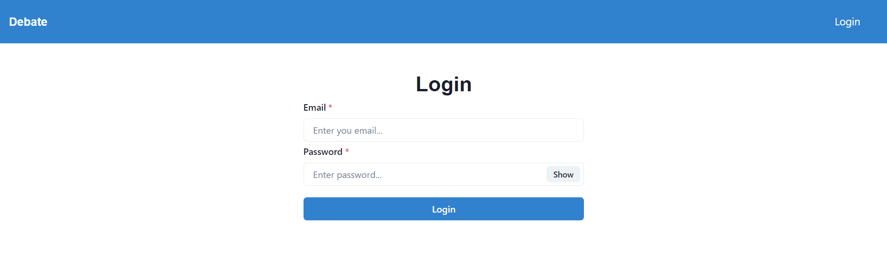

# Debate

## Description
This project's aim is to provide a platform for people to debate over arguments, whether it is about politics, religion, morals, meaning of life or anything else.

## Table of Contents
- [Architecture](#architecture)
- [Installation](#installation)
- [Usage](#usage)
- [Screenshots](#screenshots)
- [Contributing](#contributing)
- [Additional Information](#addinfo)

## Architecture :
### Backend
`index.js`: Database connection and server setup\
`models`: Database models' definition using mongoose\
`middlewares`: Authentication middleware\
`routes`: Route definition using express\
`controllers`: Controller function definitions, to write or read data\

### Frontend
`public`: Holds user image uploads and default images\
`contexts_store`: Redux store definition\
`hooks`: Hooks for API calls and redux store read & write\
`pages`: Client side pages\
`components`: smaller react components to be used within pages or other components\
`utils`: Functions to read locally saved auth token and create socket connection

## Installation :
To install the project, follow these steps:

Clone the repository: `https://github.com/pnaruka/debate`\
Navigate to the project directory: `cd blog_app`

Install dependencies:\
backend:
`cd backend`
`npm install`

frontend:
`cd frontend`
`npm install`

## Usage :
After installation, you can use the project as follows:

Run the project: `cd backend` `npm start`\
open another terminal: `cd frontend` `npm start`\
Access the application through your web browser at `http://localhost:3000` 

## Screenshots :
`Signup`:  \
`Login`:  \
`Landing Page`:  \
`Home`:  \
`Create Debate`:  \
`Debate View`: 

## Contributing :
Contributions are welcome! Here's how you can contribute:\
Fork the repository\
Create a new branch: `git checkout -b feature`\
Make your changes and commit them: `git commit -am 'Add new feature'`\
Push to the branch: `git push origin feature`\
Submit a pull request

## Additional Information 

For additional information or support, please contact the project maintainers at pankajnaruka111@gmail.com.
